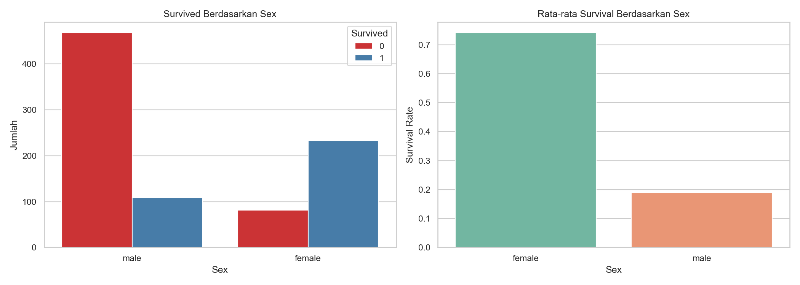
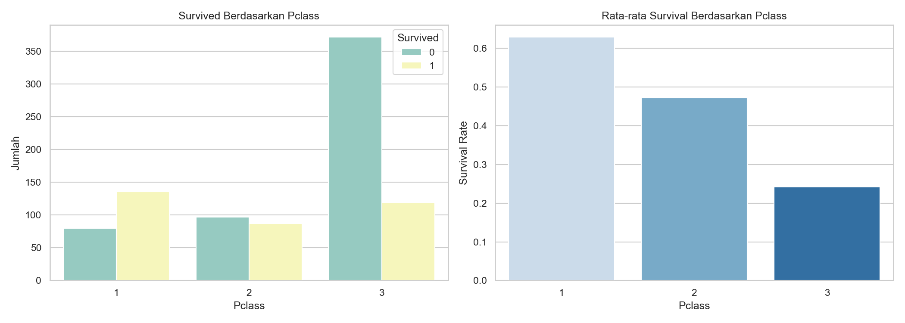
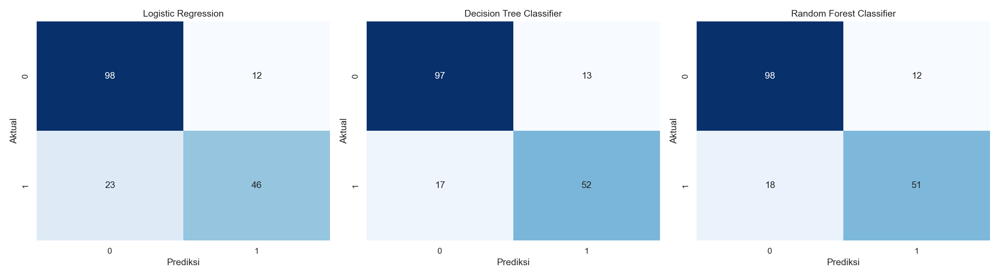

# Analisis dan Prediksi Kelangsungan Hidup Penumpang Titanic

## Latar Belakang & Masalah
Proyek ini menganalisis faktor demografis dan sosial ekonomi penumpang Titanic untuk memodelkan kelangsungan hidup (*survival rate*) saat krisis maritim, menggunakan algoritma klasifikasi Python.

---

## Ringkasan Eksekutif

- **Tujuan**: Membangun model klasifikasi biner memprediksi kelangsungan hidup penumpang (`Survived = 1` vs `0`) berdasarkan fitur sosial ekonomi dan demografi.
- **Temuan Utama**:
  - **Faktor Gender**: Jenis kelamin merupakan prediktor paling signifikan. Perempuan mencatatkan tingkat keselamatan **74,20%**, jauh lebih tinggi dibanding laki-laki (**18,89%**).
  - **Faktor Kelas Sosial**: Penumpang Kelas 1 memiliki peluang selamat tertinggi (**62,96%**), diikuti Kelas 2 (**47,28%**), dan Kelas 3 (**24,24%**).
  - **Evaluasi Model**: Model **Decision Tree** dan **Random Forest** mencatatkan akurasi terbaik (**83,24%**) dibanding **Logistic Regression** (**80,45%**).
  - **Model Terpilih**: Decision Tree Classifier dipilih untuk estimasi akhir karena memiliki skor akurasi tinggi, F1-Score seimbang, serta kemudahan dalam interpretasi pohon keputusan.

---

## Kualitas Data & Metodologi

- **Imputasi Data**: Fitur `Age` (19,8% data kosong) diimputasi menggunakan nilai median berdasarkan pengelompokan `Pclass` dan `Sex`. Fitur `Cabin` dibuang karena 77,1% data kosong. Nilai kosong pada `Embarked` diisi dengan modus.
- **Penanganan Outlier**: Nilai ekstrem pada tarif tiket (seperti `£512`) tetap dipertahankan karena mencerminkan akomodasi kelas atas (*suite room*) riil dan bukan kesalahan entri data.
- **Asumsi**: Fitur `Pclass` diasumsikan mencerminkan status sosial ekonomi serta akses fisik/jarak kabin menuju dek sekoci penyelamat.

---

## Metrik Evaluasi & Perbandingan Model

Evaluasi model pada data validasi (rasio pembagian latih-uji 80:20):

| Model | Akurasi | Kelas Target | Presisi (Precision) | Recall | F1-Score |
| :--- | :---: | :---: | :---: | :---: | :---: |
| **Decision Tree Classifier** | **0.8324** | **0 (Tidak Selamat)** **1 (Selamat)** | **0.85** **0.80** | **0.88** **0.75** | **0.87** **0.78** |
| **Random Forest Classifier** | **0.8324** | **0 (Tidak Selamat)** **1 (Selamat)** | **0.84** **0.81** | **0.89** **0.74** | **0.87** **0.77** |
| **Logistic Regression** | **0.8045** | **0 (Tidak Selamat)** **1 (Selamat)** | **0.81** **0.79** | **0.89** **0.67** | **0.85** **0.72** |

---

## Wawasan Utama & Visualisasi

### 1. Keselamatan Berdasarkan Jenis Kelamin
Tingkat keselamatan penumpang perempuan (**74,20%**) jauh lebih tinggi daripada laki-laki (**18,89%**).

### 2. Keselamatan Berdasarkan Kelas Tiket
Persentase keselamatan penumpang Kelas 1 (**62,96%**) mengungguli Kelas 2 (**47,28%**) dan Kelas 3 (**24,24%**).

### 3. Korelasi Fitur Numerik
Tingkat tarif tiket (`Fare`) dan kelas kabin (`Pclass`) memiliki hubungan paling kuat terhadap peluang keselamatan.

### 4. Confusion Matrix Model
Menampilkan distribusi prediksi benar/salah untuk Decision Tree, Random Forest, dan Logistic Regression pada dataset uji validasi.

---

## Keterbatasan & Rencana Pengembangan

- **Keterbatasan**: Dataset terbatas pada data historis statis dan belum mencakup variabel psikologis atau spasial lokasi kabin riil.
- **Rencana Pengembangan**:
  1. Pengujian algoritma pembobotan ansambel lanjutan (XGBoost/LightGBM).
  2. Implementasi nilai SHAP (SHapley Additive exPlanations) untuk analisis kontribusi fitur tingkat individu.

---

## Reproduksibilitas

1. **Lingkungan**: Python 3.11.x (NumPy, Pandas, Matplotlib, Seaborn, Scikit-learn).
2. **Langkah Eksekusi**:
   - Simpan dataset di direktori `data/`.
   - Jalankan [notebook.ipynb](notebook.ipynb) dari awal hingga akhir.
3. **Random Seed**: Nilai `random_state = 42` disematkan pada pemodelan untuk konsistensi hasil evaluasi.

---

## Struktur Direktori
- **`data/`**: File dataset CSV (`train.csv`, `test.csv`, `gender_submission.csv`).
- **`visual/`**: Hasil ekspor grafik eksplorasi data (EDA) dan matriks evaluasi.
- **`notebook.ipynb`**: Notebook analisis, rekayasa fitur, dan pemodelan.
- **`submission.csv`**: File hasil prediksi akhir model terbaik.
