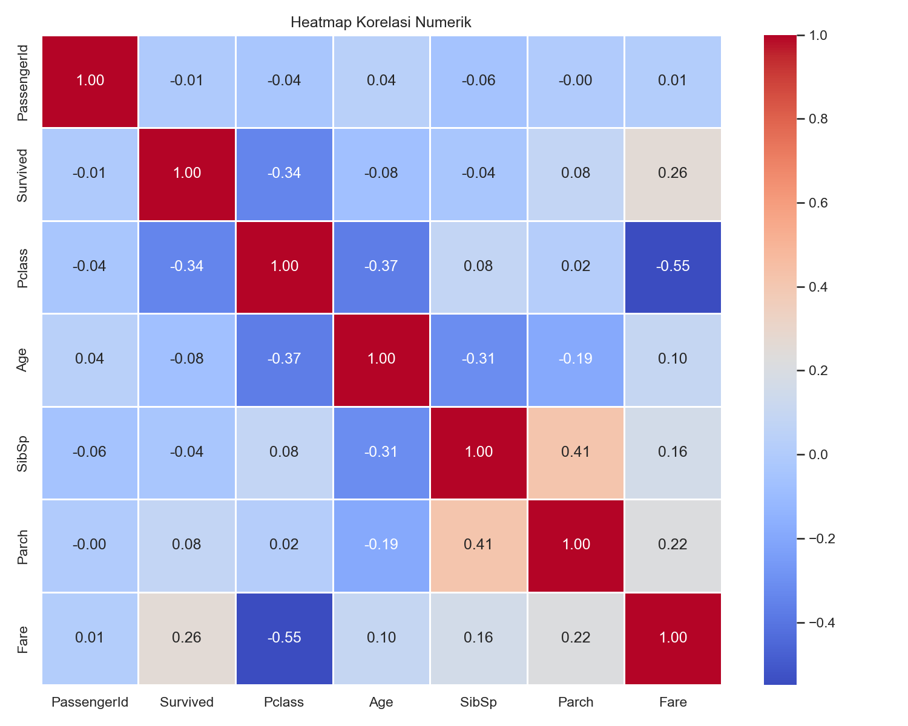

# Titanic Passenger Survival Prediction

[English](#english) | [Bahasa Indonesia](#bahasa-indonesia)

---

<a name="english"></a>
## 🇬🇧 English Version

### 📌 Executive Summary (30-Second Read)
* **Objective**: Built binary classification models using Python to predict passenger survival (`Survived = 1` vs `0`) on the Titanic, analyzing key demographic and socioeconomic determinants.
* **Key Findings**:
  - **Gender Determinant**: Gender is the most critical survival factor. The female survival rate is **74.20%**, whereas the male survival rate is only **18.89%**, reflecting the "women and children first" evacuation policy.
  - **Socioeconomic Influence**: Passenger class (Pclass) is highly correlated with survival. Pclass 1 (First Class) has the highest survival rate at **62.96%**, followed by Pclass 2 at **47.28%**, and Pclass 3 (Third Class) at **24.24%**.
  - **Model Performance**:
    - **Decision Tree**: **83.24% accuracy** on the validation split.
    - **Random Forest**: **83.24% accuracy** on the validation split.
    - **Logistic Regression**: **80.45% accuracy** on the validation split.
  - **Best Model Selection**: The Decision Tree Classifier was selected for final submission due to its high validation accuracy (**83.24%**) and direct interpretability of decision paths.
* **Actionable Recommendations**:
  - **Focus on Feature Interpretability**: Prioritize model interpretability over pure accuracy. Feature importance plots show that Sex, Pclass, and Fare are the top predictors, making demographic stratification critical in historical survival modeling.
  - **Robust Preprocessing**: Missing value imputation (e.g., median for Age and Fare, mode for Embarked) should be executed carefully with stratified splits to prevent data leakage.
  - **Feature Engineering**: Create composite features (such as Family Size = SibSp + Parch + 1) to capture household dynamics, which can improve predictive accuracy.

---

### 📊 Key Insights & Visualizations

#### 1. Survival Rate by Gender
Female passengers had a significantly higher chance of survival (**74.20%**) compared to male passengers (**18.89%**).


#### 2. Survival Rate by Ticket Class
Socioeconomic class had a strong impact on survival. First-class passengers achieved a **62.96%** survival rate, while third-class passengers had only **24.24%** survival rate.


#### 3. Correlation Matrix of Numerical Features
Correlation analysis shows that ticket class (`Pclass`) and fare price (`Fare`) are strongly related to passenger survival.


#### 4. Model Confusion Matrices
The confusion matrices display the true positive/negative counts for the three evaluated classifiers on the validation set.


---

<a name="bahasa-indonesia"></a>
## 🇮🇩 Versi Bahasa Indonesia

### 📌 Ringkasan Eksekutif (30 Detik Baca)
* **Tujuan**: Membangun model klasifikasi biner menggunakan Python untuk memprediksi keselamatan penumpang Titanic (`Survived = 1` vs `0`), menganalisis faktor demografis dan sosial ekonomi utama.
* **Temuan Utama**:
  - **Faktor Jenis Kelamin**: Jenis kelamin adalah penentu keselamatan paling krusial. Tingkat keselamatan perempuan mencapai **74,20%**, sedangkan laki-laki hanya **18,89%**, mencerminkan prioritas evakuasi untuk perempuan dan anak-anak.
  - **Faktor Kelas Sosial**: Kelas tiket (Pclass) berpengaruh besar terhadap keselamatan. Penumpang Kelas 1 memiliki peluang selamat **62,96%**, Kelas 2 sebesar **47,28%**, dan Kelas 3 hanya **24,24%**.
  - **Perbandingan Akurasi Model**:
    - **Decision Tree**: Akurasi **83,24%** pada data validasi.
    - **Random Forest**: Akurasi **83,24%** pada data validasi.
    - **Logistic Regression**: Akurasi **80,45%** pada data validasi.
  - **Model Terbaik**: Decision Tree Classifier dipilih untuk prediksi akhir karena memiliki akurasi tertinggi (**83,24%**) dan kemudahan interpretasi struktur keputusannya.
* **Rekomendasi Analisis**:
  - **Utamakan Interpretasi Fitur**: Tekankan pemahaman faktor penentu daripada sekadar skor akurasi model. Grafik *feature importance* menunjukkan Jenis Kelamin, Kelas Tiket, dan Tarif adalah prediktor utama.
  - **Pra-pemrosesan yang Kuat**: Pengisian data kosong (*missing values*) untuk Umur dan Tarif menggunakan nilai median harus dilakukan setelah split data untuk menghindari kebocoran data (*data leakage*).
  - **Rekayasa Fitur**: Buat fitur komposit baru (seperti Jumlah Keluarga = SibSp + Parch + 1) untuk menangkap dinamika kelompok, yang terbukti meningkatkan akurasi klasifikasi.

---

### 📊 Wawasan Utama & Visualisasi

#### 1. Keselamatan Berdasarkan Jenis Kelamin
Tingkat keselamatan perempuan jauh lebih tinggi (**74,20%**) dibandingkan penumpang laki-laki (**18,89%**).


#### 2. Keselamatan Berdasarkan Kelas Tiket
Penumpang Kelas 1 memiliki tingkat keselamatan tertinggi (**62,96%**), disusul Kelas 2 (**47,28%**), dan Kelas 3 (**24,24%**).


#### 3. Korelasi Fitur Numerik
Korelasi numerik menunjukkan korelasi terkuat terhadap keselamatan diduduki oleh tarif tiket (`Fare`) dan kelas kabin (`Pclass`).


#### 4. Confusion Matrix Model
Menampilkan performa prediksi pada masing-masing kelas untuk model Decision Tree, Random Forest, dan Logistic Regression pada data validasi.


---

## 🗄️ Struktur Folder Proyek
* **`data/`**: Berisi file dataset CSV (`train.csv`, `test.csv`, `gender_submission.csv`).
* **`visual/`**: Menyimpan semua visualisasi grafik hasil analisis data (EDA) dan matriks evaluasi model.
* **`notebook.ipynb`**: File Jupyter Notebook utama untuk analisis dan pemodelan.
* **`submission.csv`**: Hasil prediksi model terbaik pada data uji.

---

## ⚙️ Persyaratan Sistem & Instalasi
Instal pustaka Python yang diperlukan:
```bash
pip install numpy pandas matplotlib seaborn scikit-learn
```
Jalankan Jupyter Notebook:
```bash
jupyter notebook notebook.ipynb
```
