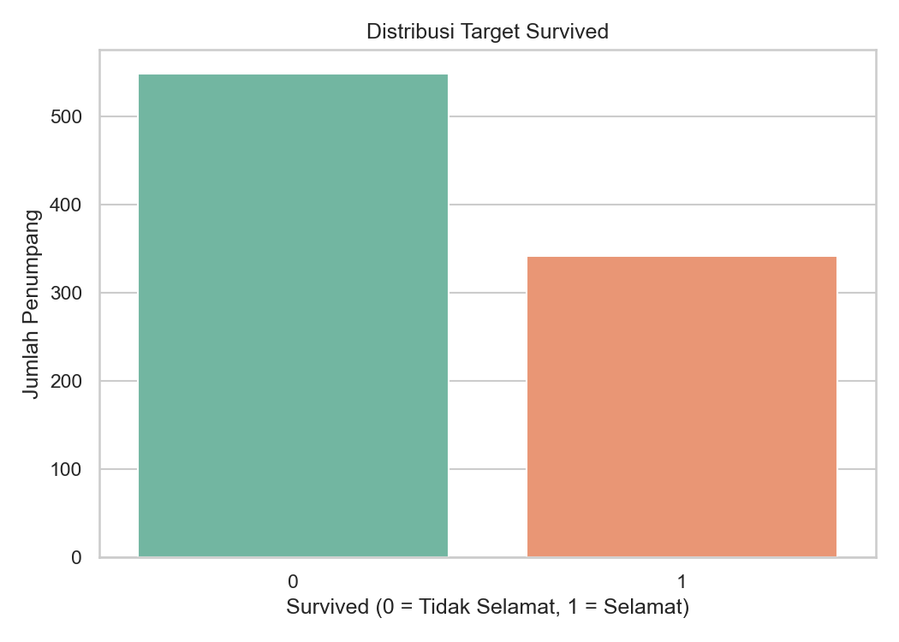

# Titanic Survival Prediction

Proyek machine learning ini memprediksi apakah penumpang Titanic selamat (`Survived = 1`) atau tidak selamat (`Survived = 0`) menggunakan dataset dari Kaggle.

Notebook analisis utama dapat diakses di [notebook.ipynb](notebook.ipynb) dan hasil prediksi akhir disimpan di [submission.csv](submission.csv).

---

## Struktur Folder Proyek

Untuk menjaga kebersihan repositori, proyek ini dibagi menjadi beberapa direktori:
- **`data/`**: Berisi seluruh file dataset CSV (`train.csv`, `test.csv`, `gender_submission.csv`).
- **`visual/`**: Menyimpan semua visualisasi grafik hasil analisis data (EDA) dan matriks evaluasi model.
- **`notebook.ipynb`**: File Jupyter Notebook utama untuk analisis dan pemodelan.
- **`submission.csv`**: Hasil prediksi model terbaik pada data uji.

---

## Dataset yang Digunakan

Dataset disimpan di dalam folder [data/](data/):
- [train.csv](data/train.csv) — Data latih dengan label target `Survived`.
- [test.csv](data/test.csv) — Data uji untuk memprediksi survival penumpang.
- [gender_submission.csv](data/gender_submission.csv) — Contoh format submission dari Kaggle.

---

## Tahapan Pengerjaan

1. **Import Library**: Menyiapkan library utama (`pandas`, `numpy`, `matplotlib`, `seaborn`, `sklearn`).
2. **Load Dataset**: Memuat data train dan test dari folder `data/`.
3. **Exploratory Data Analysis (EDA)**: Menganalisis sebaran data dan korelasi antar fitur.
4. **Data Preprocessing**: Mengisi *missing values* (`Age`, `Fare`, `Embarked`), menghapus kolom yang tidak relevan (`Cabin`, `Name`, `Ticket`), dan melakukan *Label Encoding*.
5. **Feature Selection**: Memilih fitur prediktor yang signifikan.
6. **Train-Test Split**: Membagi data train menjadi data latih dan validasi dengan rasio 80:20 (menggunakan *stratified split*).
7. **Model Training**: Melatih beberapa model klasifikasi (Logistic Regression, Decision Tree, Random Forest).
8. **Evaluasi & Perbandingan**: Membandingkan model berdasarkan akurasi dan confusion matrix.
9. **Prediksi Akhir**: Melatih ulang model terbaik pada seluruh data training dan membuat file `submission.csv`.

---

## Hasil Analisis (EDA)

Berikut beberapa visualisasi hasil Exploratory Data Analysis yang disimpan di folder [visual/](visual/):

### 1. Distribusi Target (Survived)
Sebagian besar penumpang di dalam dataset tidak selamat. Hal ini menunjukkan pentingnya model untuk mempelajari karakteristik penumpang secara akurat.

### 2. Analisis Berdasarkan Jenis Kelamin (Sex)
Survival rate penumpang perempuan jauh lebih tinggi dibandingkan laki-laki. Ini mencerminkan kebijakan evakuasi "wanita dan anak-anak didahulukan".

### 3. Analisis Berdasarkan Kelas Tiket (Pclass)
Penumpang Kelas 1 (First Class) memiliki peluang keselamatan tertinggi, disusul Kelas 2, sementara Kelas 3 memiliki peluang terendah. Hal ini berkorelasi dengan lokasi kabin dan akses evakuasi.

### 4. Heatmap Korelasi Fitur Numerik
Korelasi numerik menunjukkan korelasi terkuat terhadap keselamatan diduduki oleh tarif tiket (`Fare`) dan kelas kabin (`Pclass`).

---

## Perbandingan Model & Evaluasi

Tiga model dievaluasi menggunakan data validasi (20% split) dan menghasilkan akurasi sebagai berikut:

| Model | Accuracy |
| :--- | :---: |
| **Decision Tree Classifier** | **0.8324** |
| **Random Forest Classifier** | **0.8324** |
| **Logistic Regression** | **0.8045** |

Visualisasi *Confusion Matrix* dari ketiga model menunjukkan performa prediksi pada masing-masing kelas:

---

## Kesimpulan

1. **Model Terbaik**: **Decision Tree Classifier** dan **Random Forest Classifier** menghasilkan tingkat akurasi tertinggi sebesar **83.24%** pada data validasi. Model Decision Tree akhirnya dipilih untuk melakukan prediksi akhir karena strukturnya yang sederhana namun sangat efektif untuk dataset ini.
2. **Faktor Utama Keselamatan**:
   - **Jenis Kelamin (`Sex`)**: Merupakan faktor terpenting. Penumpang perempuan diprioritaskan saat evakuasi.
   - **Kelas Sosial/Tiket (`Pclass`)**: Penumpang kelas 1 memiliki akses dan prioritas keselamatan yang jauh lebih baik dibandingkan kelas 3.
3. **Data Preprocessing**: Pengisian *missing value* menggunakan nilai median untuk `Age`/`Fare` dan mode untuk `Embarked` berhasil menjaga kelengkapan informasi tanpa terjadi kebocoran data (*data leakage*).
